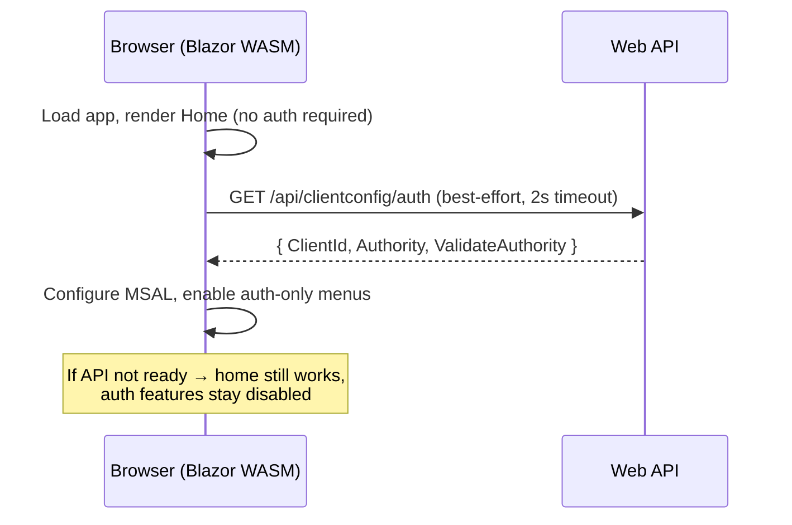

# 02.02 AspnetBlazor — Blazor WebAssembly + Web API sample

This sample demonstrates a **Blazor WebAssembly** client and an **ASP.NET Core Web API**,
both secured with **Microsoft Entra ID (Azure AD)**, wired together so that:

- authentication is **not forced into the client startup sequence** (the app stays fast and the home page renders immediately);
- **sensitive / environment-specific IDs live only on the server**, so they can be loaded from an internal repository or an **Azure Key Vault**;
- API endpoints are exposed **lowercase** via a route token transformer;
- client and server share a single **model project** to avoid duplicated DTOs.

---

## Projects

| Project | Type | Purpose |
| --- | --- | --- |
| [B02_01_BlazorWebassemblyApp](B02_01_BlazorWebassemblyApp) | Blazor WebAssembly | The SPA client (UI, pages, MSAL auth). |
| [B02_02_BlazorWebassemblyApi](B02_02_BlazorWebassemblyApi) | ASP.NET Core Web API | Protected API + server-side configuration endpoint. |
| [B02_02_BlazorWebassemblyModel](B02_02_BlazorWebassemblyModel) | netstandard2.1 library | Shared DTOs used by both client and API. |

Default local URLs:

- Client: `https://localhost:7123`
- API: `https://localhost:7252` (Swagger UI at `/swagger`)

---

## How to run

The client depends on the API being available, so the API must start first.

### Option A — Visual Studio (recommended)

1. Open [Telemetry.Samples.slnx](../Telemetry.Samples.slnx).
2. Select the **Blazor API + Client** startup profile (configured in
   [Telemetry.Samples.slnLaunch.user](../Telemetry.Samples.slnLaunch.user)).
   It starts the API first, then the client.
3. Press **F5**.

### Option B — two terminals

```powershell
dotnet run --project ".\B02_02_BlazorWebassemblyApi\B02_02_BlazorWebassemblyApi.csproj"
dotnet run --project ".\B02_01_BlazorWebassemblyApp\B02_01_BlazorWebassemblyApp.csproj"
```

> The client also retries/times-out gracefully if the API is not yet reachable — see
> [Non-blocking startup](#1-non-blocking-authentication-startup) below.

---

## Interesting aspects

### 1. Non-blocking authentication startup

The client **does not block** on authentication configuration during boot. The home page,
counter and weather pages are usable immediately, even if the API/config is not ready yet.

In [B02_01_BlazorWebassemblyApp/Program.cs](B02_01_BlazorWebassemblyApp/Program.cs) the client:

1. performs a **best-effort** config fetch with a short (2s) timeout;
2. never throws on startup if config is missing (it falls back to a placeholder client id);
3. records readiness in a `ClientAuthBootstrapState` singleton.

```csharp
var serverAuthConfig = await TryLoadServerAuthConfigAsync(serverConfigBaseUrl, authEndpoint);

var authBootstrapState = new ClientAuthBootstrapState
{
    IsConfigLoaded = serverAuthConfig is not null,
    IsAuthenticationConfigured = !string.IsNullOrWhiteSpace(serverAuthConfig?.ClientId)
};
builder.Services.AddSingleton(authBootstrapState);
```

Auth-dependent UI stays **disabled until the configuration is loaded and the user is authenticated**:

- the **Show profile** menu entry in [Layout/NavMenu.razor](B02_01_BlazorWebassemblyApp/Layout/NavMenu.razor);
- the **Log in** action in [Layout/LoginDisplay.razor](B02_01_BlazorWebassemblyApp/Layout/LoginDisplay.razor).

### 2. Sensitive configuration lives on the server

The client `wwwroot/appsettings.json` intentionally **does not contain the `ClientId`**.
Instead the client fetches its auth configuration at runtime from the API:

- [B02_01_BlazorWebassemblyApp/wwwroot/appsettings.json](B02_01_BlazorWebassemblyApp/wwwroot/appsettings.json)

```jsonc
{
  "AzureAd": {
    "Authority": "https://login.microsoftonline.com/<tenant>",
    "ValidateAuthority": true
  },
  "ServerConfig": {
    "BaseUrl": "https://localhost:7252",
    "AuthEndpoint": "api/clientconfig/auth"
  }
}
```

The server exposes the client auth config from a dedicated section (`BlazorClientAuth`),
which can be backed by **User Secrets** in development and an **Azure Key Vault** in the cloud:

- [B02_02_BlazorWebassemblyApi/Controllers/ClientConfigController.cs](B02_02_BlazorWebassemblyApi/Controllers/ClientConfigController.cs)

```csharp
[ApiController]
[Route("api/[controller]")]
public class ClientConfigController : ControllerBase
{
    [AllowAnonymous]
    [HttpGet("auth")]
    public IActionResult GetAuthConfig() => Ok(new ClientAuthConfigResponse
    {
        ClientId = configuration["BlazorClientAuth:ClientId"],
        Authority = configuration["BlazorClientAuth:Authority"],
        ValidateAuthority = /* parsed */ null
    });
}
```

> **Security note:** an OAuth SPA **ClientId is not itself a secret** — it is always
> visible to the browser at runtime. The value of this pattern is that the ID is not
> committed to the client repo/static files, and it can be sourced from a Key Vault
> per environment. Real secrets (e.g. `ClientSecret`) must **only ever** stay server-side.

Store the client id in server-side User Secrets for local development:

```powershell
dotnet user-secrets --project ".\B02_02_BlazorWebassemblyApi\B02_02_BlazorWebassemblyApi.csproj" `
  set "BlazorClientAuth:ClientId" "<your-spa-client-id>"
```

### 3. Environment-specific configuration

Standard ASP.NET Core configuration layering applies: `appsettings.json` is overlaid by
`appsettings.{Environment}.json`. A `testmc` environment is provided as an example:

- [B02_02_BlazorWebassemblyApi/appsettings.testmc.json](B02_02_BlazorWebassemblyApi/appsettings.testmc.json)
- launch profile **`https - testmc`** in
  [B02_02_BlazorWebassemblyApi/Properties/launchSettings.json](B02_02_BlazorWebassemblyApi/Properties/launchSettings.json)
  sets `ASPNETCORE_ENVIRONMENT=testmc`.

This keeps per-environment tenant/client IDs isolated in their own file.

### 4. Lowercase API endpoints

Controllers use the default `api/[controller]` convention (so the **route stays consistent
with the class name**), but a route token transformer forces the generated URLs to lowercase:

- [B02_02_BlazorWebassemblyApi/Routing/LowercaseParameterTransformer.cs](B02_02_BlazorWebassemblyApi/Routing/LowercaseParameterTransformer.cs)
- registered in [B02_02_BlazorWebassemblyApi/Program.cs](B02_02_BlazorWebassemblyApi/Program.cs):

```csharp
builder.Services.AddControllers(options =>
{
    options.Conventions.Add(new RouteTokenTransformerConvention(new LowercaseParameterTransformer()));
});
```

Resulting routes:

- `/api/clientconfig/auth`
- `/api/weatherforecast`

### 5. Shared model project (no duplicated DTOs)

The auth config DTO is defined **once** in the shared model and reused by both sides:

- [B02_02_BlazorWebassemblyModel/ClientAuthConfigResponse.cs](B02_02_BlazorWebassemblyModel/ClientAuthConfigResponse.cs)

Both the client (`GetFromJsonAsync<ClientAuthConfigResponse>`) and the API
(`return Ok(new ClientAuthConfigResponse { ... })`) use this single type.

### 6. Code-behind for Razor components

All Razor components keep markup only; logic lives in matching `.razor.cs` partial classes,
e.g. [Pages/Counter.razor](B02_01_BlazorWebassemblyApp/Pages/Counter.razor) +
[Pages/Counter.razor.cs](B02_01_BlazorWebassemblyApp/Pages/Counter.razor.cs).

### 7. CORS between client and API

The API allows the client origins explicitly (see `AddCors`/`UseCors("BlazorClient")` in
[B02_02_BlazorWebassemblyApi/Program.cs](B02_02_BlazorWebassemblyApi/Program.cs)), which is
required because the anonymous config endpoint is called cross-origin before sign-in.

### 8. Swagger / OpenAPI in all non-production environments

OpenAPI + Swagger UI (with the Azure AD OAuth2 + PKCE flow wired in) are enabled for **every
non-production environment** (Development, `test*`, `stage*`, …), not just Development:

```csharp
if (!app.Environment.IsProduction())
{
    app.MapOpenApi();
    app.UseSwaggerUI(/* OAuth2 + PKCE */);
}
```

### 9. Static Bootstrap asset

The client references Bootstrap from a **local** static asset
(`wwwroot/lib/bootstrap/dist/css/bootstrap.min.css`) to avoid CDN/offline and service-worker
caching inconsistencies. If you see an unstyled page, hard-refresh (Ctrl+F5) and, if needed,
unregister the service worker once in DevTools.

---

## Configuration reference

### Client — `wwwroot/appsettings.json`

| Key | Meaning |
| --- | --- |
| `AzureAd:Authority` | Entra ID authority (tenant). |
| `AzureAd:ValidateAuthority` | Whether MSAL validates the authority. |
| `ServerConfig:BaseUrl` | Base URL of the API providing auth config. |
| `ServerConfig:AuthEndpoint` | Relative path of the config endpoint (lowercase). |

> The client `ClientId` is intentionally **absent** — it is supplied by the server.

### Server — `appsettings*.json` / User Secrets / Key Vault

| Key | Meaning |
| --- | --- |
| `AzureAd:*` | The API's own app registration (audience, tenant, scopes). |
| `BlazorClientAuth:ClientId` | The **SPA** client id served to the Blazor app. |
| `BlazorClientAuth:Authority` | Authority served to the Blazor app. |
| `BlazorClientAuth:ValidateAuthority` | Authority validation flag served to the app. |
| `MicrosoftGraph:*` | Downstream Graph configuration. |

---

## Startup / dependency flow


